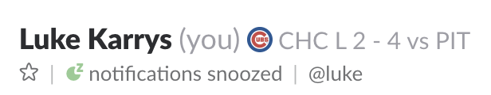

# mlb-slack-status

[](https://greenkeeper.io/)

Sync you Slack status with an MLB team.




## Usage

```sh
git clone git@github.com:lukekarrys/mlb-slack-status.git
cd mlb-slack-status
npm install
cp .env.example .env
```

1. Acquire a Slack token. You could setup a [Slack app](https://api.slack.com/docs/oauth) with a [`users.profile:write` scope](https://api.slack.com/methods/users.profile.set) (takes some work) or use a [legacy token](https://api.slack.com/custom-integrations/legacy-tokens) (not so much work)
1. Edit `.env` with your `TOKEN` and favorite [`TEAM`](./lib/teams.js)
1. __Bonus:__ upload your team's logo as an emoji in Slack and set it as `EMOJI` in `.env`
1. `npm run deploy && npm run clean` (the `clean` part will remove any old deploys)


## What it does

You should now have a server that updates your Slack status to your team's current result. That result will be one of the following:

- **Scheduled**: `CHC – 8:05 EDT vs PIT`

  If a game is scheduled for that day it will set your status to the time of the game. The server will then sleep until the start of the game before attempting to update your status again.

- **In progress**: `CHC – 1-0 Top 4th vs PIT`

  If a game is in progress it will set your status to the current result of the game. It will check on a [set interval](./.env.example#L4) until the game is complete.

- **Completed**: `CHC – L 1-6 vs PIT`

  Once the game is completed it will set your status the the final result of the game. The server will then sleep until [the next day](./.env.example#L5-L6) before trying to find the next game.

- **Off day**: `CHC – No game today`

  If there is no game scheduled, it will set your status as described. The server will then sleep until [the next day](./.env.example#L5-L6) before trying to find the next game.


## LICENSE

MIT
